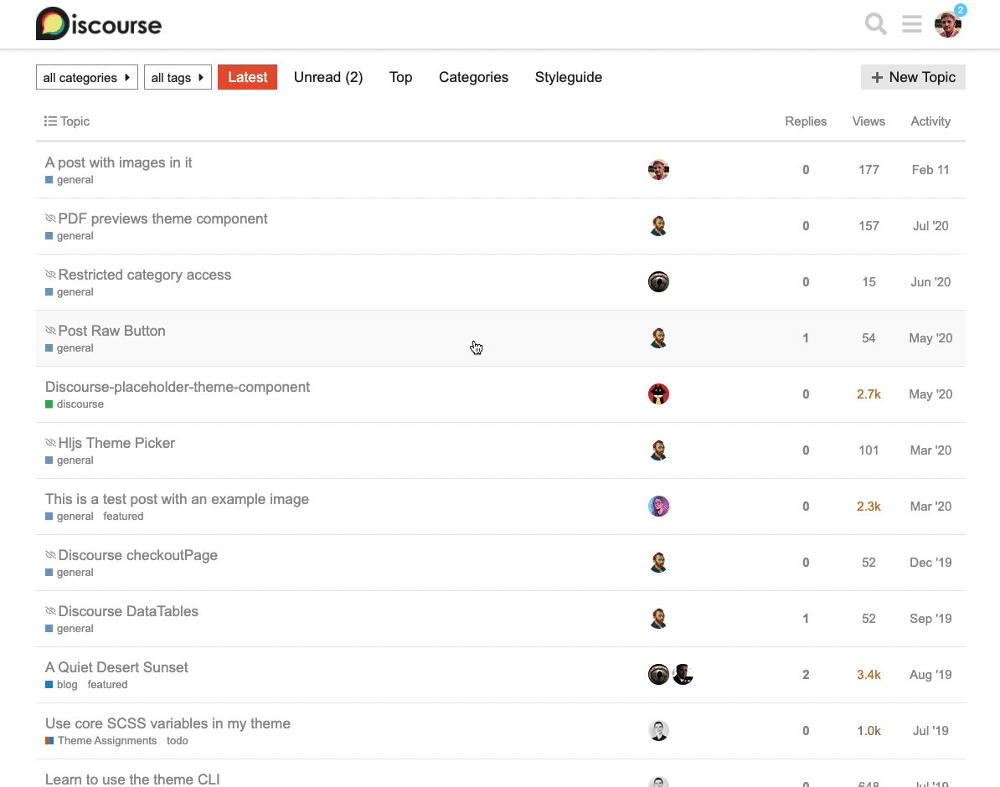

# Discourse Clickable Topic Component
This component makes the entire area of a `topic-list-item` clickable, as opposed to just the title.

[Preview on theme-creator](https://theme-creator.discourse.org/theme/jordan.vidrine/clickable-topic 
)
